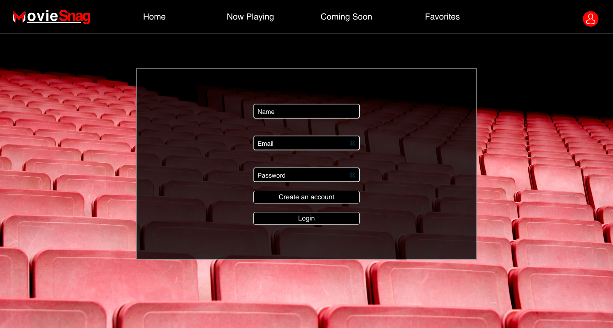
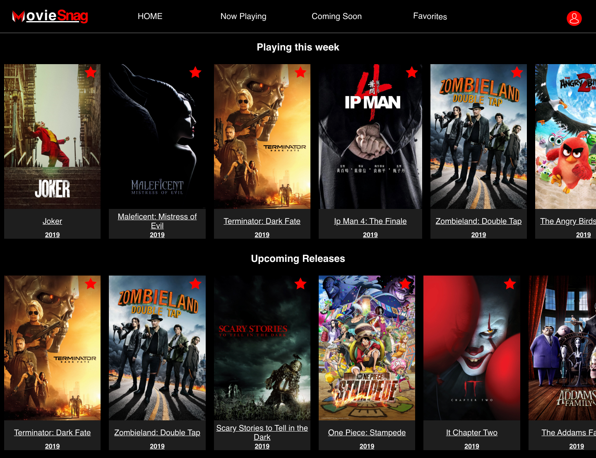
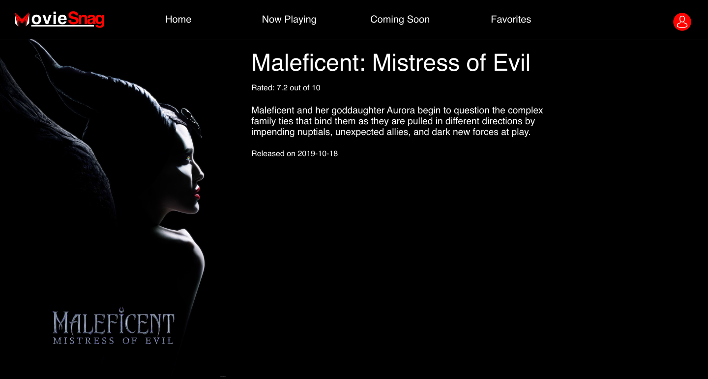

# MovieSnag: A Movie Tracking web app

## Summary

Ever been curious about what movies are currently out in theaters and wish you could get more info about them? Welcome to Movie Tracker where you can sign in, see the latest movies, and favorite them for later.

MovieSnag uses the Movie DB API to provide the user a database of multitudes of popular films. Designed to practice the usage of Redux store combined with a React application. The application's componenents are fully tested using the Jest testing suite.


## Collaborators  
- Scott Schipke- [github account](https://github.com/sschipke)
- Kirk Veitch - [github account](https://github.com/KVeitch)

## Technology  
- [The Movie DataBase API](https://www.themoviedb.org/)
- [Favorites Backend](https://github.com/turingschool-examples/favorites-tracker-api)
- React
- Redux
- React Router
- Enzyme/Jest
- JavaScript
- SCSS

## Learning Goals

This was a group project for Mod Three at Turing. The major focus was to further develop our skills utilizing React while learning the new processes of Redux. All while further honing our understanding of network requests with an API and backend. It was extremely important for us to work on our expertise, while focusing on testing as much as possible during the one week project.

## How to download  
### Clone down the frontend

1. Clone down the repo [GitHub Repository Link](https://github.com/sschipke/movie-tracker)
2. Switch to the cloned directory
3. in your terminal run  
                          ```npm install```
4. Then run   
              ```npm start```

### Clone down the backend

1. Clone down the repo [Favorites Backend](https://github.com/turingschool-examples/favorites-tracker-api)
2. Switch to the cloned directory
3. in your terminal run  
                          ```npm install```
4. Then run   
              ```npm start```


### Login Screen



### Homepage



### Favorites


### MoviePage




<a href='./DOCS/Movie_Tracker_Wireframe.pdf' target='_blank'>

### Original Wireframes

</a>


